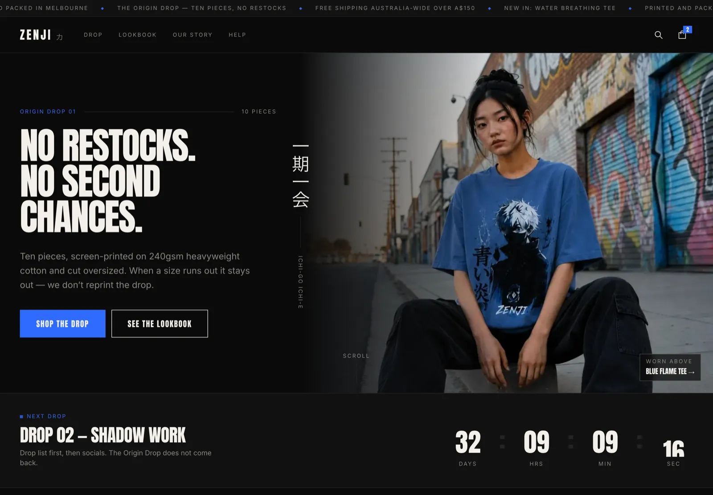
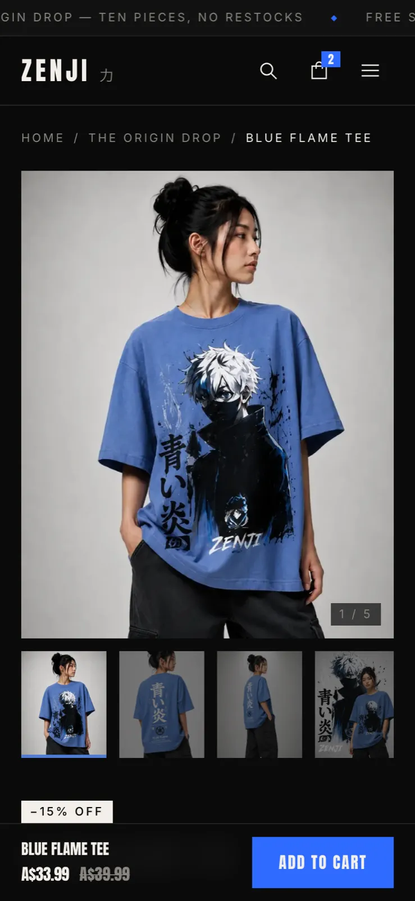
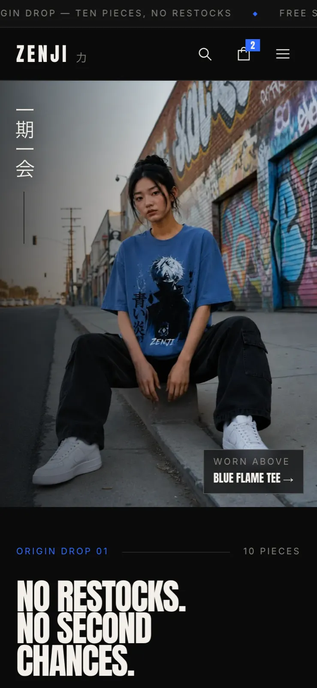
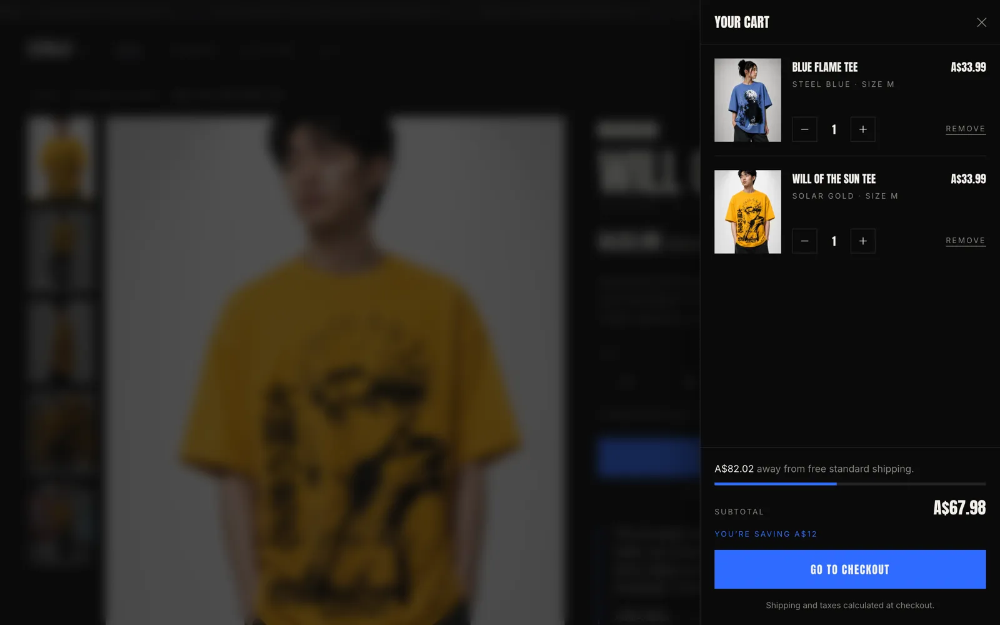
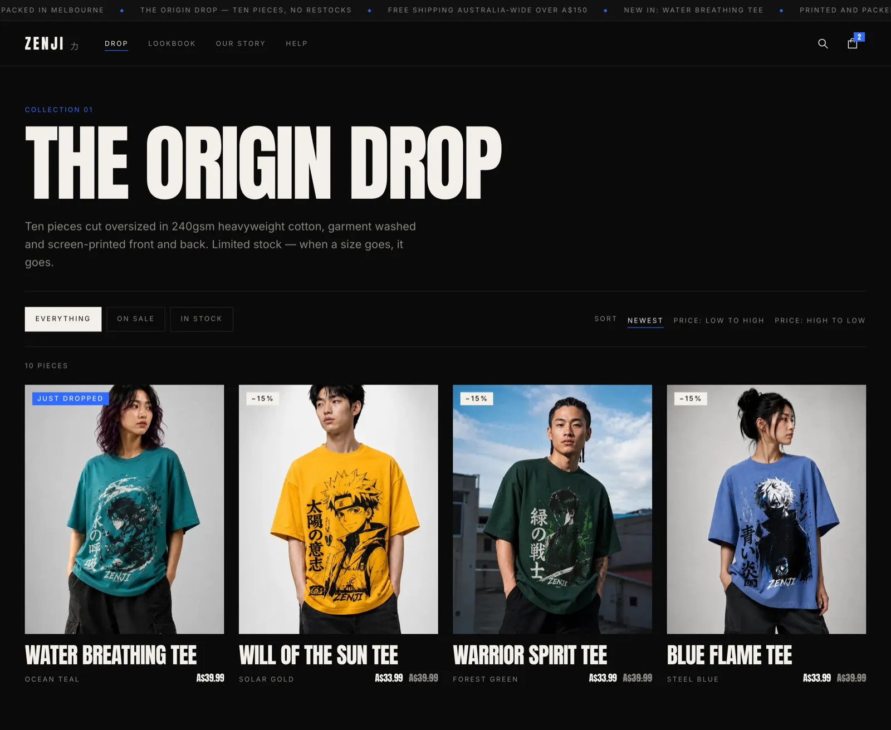
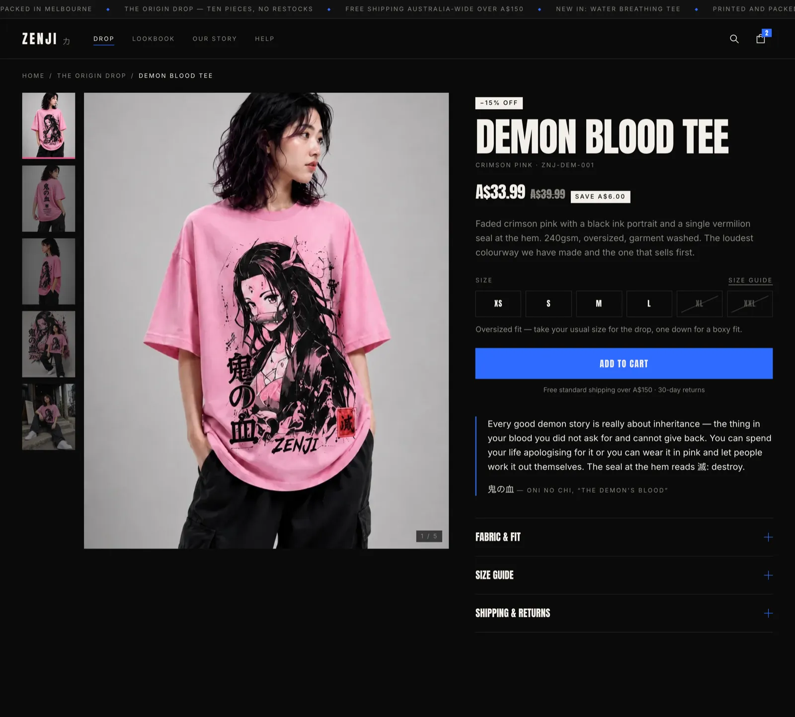
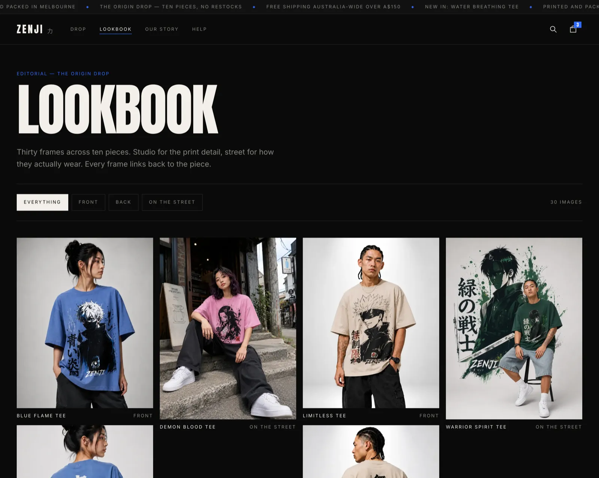
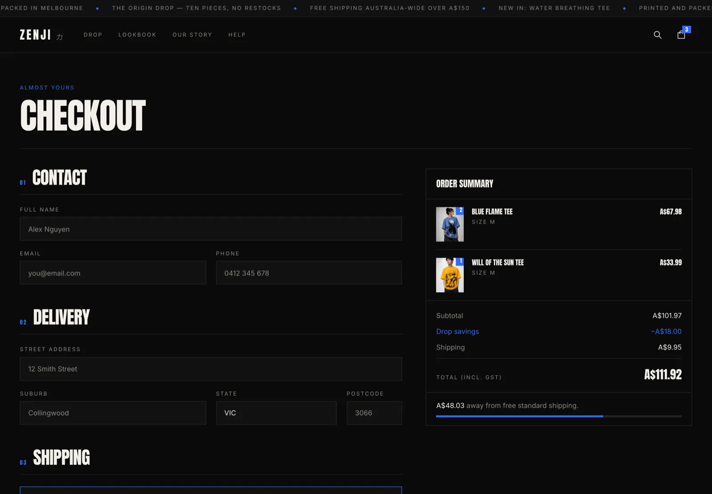

# ZENJI — storefront

An e-commerce storefront for **ZENJI**, an anime-inspired streetwear label from Melbourne.
Ten pieces, limited stock, no restocks — browse the drop, pick a size, and go all the way
through cart and checkout to a confirmed order.

Built as a frontend assessment. Next.js 15 App Router, TypeScript strict, Tailwind v4.

- **Live:** https://zenjiassessment.vercel.app
- **Repo:** https://github.com/RafayFarrukh/zenji_assessment



<table>
  <tr>
    <td width="50%"></td>
    <td width="50%"></td>
  </tr>
</table>



<details>
<summary>More screens — drop listing, product page, lookbook, checkout</summary>






</details>

---

## What's built

**The shop flow, end to end**

- **Home** — full-bleed split hero, live countdown to the next drop, collection strip, brand
  manifesto, the full ten-piece grid, lifestyle section.
- **Drop listing** (`/drop`) — filter by sale / in stock, sort by newest or price. Filters
  live in the URL and are applied **on the server**, so every combination is shareable,
  crawlable, and works without client JavaScript.
- **Product page** (`/drop/[slug]`) — five-shot gallery with a thumbnail rail (swipeable on
  a phone), size picker with real per-size stock, sold-out and low-stock states, sale price
  with the saving in dollars, sticky add-to-cart bar on mobile, fabric/size/shipping
  accordions, related pieces. Statically generated for all ten products.
- **Cart** — slide-over drawer (the primary surface) plus a `/cart` page for deep links.
  Quantity steppers clamped to available stock, free-shipping progress meter, live totals.
- **Checkout** (`/checkout`) — react-hook-form + Zod, Australian address and phone
  validation, two shipping methods that change the total, sticky order summary.
- **Confirmation** (`/checkout/confirm`) — order number, delivery estimate, address, items,
  and what happens next.

**Content and the rest**

- Our Story, Lookbook (30 frames, filterable by shot type), FAQ with a real size guide, 404.
- Client-side search over names, colourways, tags and kanji — opens with `⌘K` / `Ctrl+K`.
- Per-page metadata, Open Graph image generated at build, `sitemap.xml`, `robots.txt`,
  `Product` + `BreadcrumbList` + `FAQPage` + `Organization` JSON-LD.
- Scroll-reactive announcement bar, mobile nav, newsletter capture (validates in the
  browser; it is explicit that nothing is sent).

**Deliberately out of scope** — this is a frontend build, as briefed: no backend, no
database, no auth, no payment provider. Products are typed data in `src/data/products.ts`;
the cart lives in `localStorage`; the placed order lives in `sessionStorage`. No card
details are ever requested. Also skipped: admin panel, CMS, reviews, multi-currency,
wishlist.

## Stack, and why

|                            |                                                                                                                                                                                                                                                       |
| -------------------------- | ----------------------------------------------------------------------------------------------------------------------------------------------------------------------------------------------------------------------------------------------------- |
| **Next.js 15, App Router** | Server Components mean the catalogue, filters and JSON-LD render on the server — the product pages are static HTML with real metadata, which is what an SEO-driven store needs. `next/image` and `next/font` do the heavy lifting on Core Web Vitals. |
| **TypeScript, strict**     | Plus `noUncheckedIndexedAccess` and `noUnusedLocals`. The `Product`, `CartItem` and `Order` types are the contract the whole app is built on.                                                                                                         |
| **Tailwind v4**            | The design tokens live in one `@theme` block in `globals.css`, so the palette, type scale and motion are enforced by the class names themselves.                                                                                                      |
| **Zustand**                | The cart is the only real client state. ~1kB, persists to `localStorage`, and the stock guard lives inside the store rather than in components.                                                                                                       |
| **react-hook-form + Zod**  | Uncontrolled inputs (no re-render per keystroke) with one schema that is both the validator and the source of the `CheckoutValues` type.                                                                                                              |
| **Framer Motion**          | Only where a value has to be read at runtime — scroll position, pointer position, springs. Everything else is CSS.                                                                                                                                    |
| **Vitest**                 | Fast, no DOM needed for the logic that matters.                                                                                                                                                                                                       |

Dependency count is deliberately low. There is no icon library (nine hand-drawn SVGs), no
`clsx`/`tailwind-merge` (a four-line `cn()`), no carousel library, and no scroll-animation
library.

## Design decisions

The full system, wireframes, and a written self-critique are in [`DESIGN.md`](DESIGN.md).
The short version:

- **Same brand, different designer.** The reference site's own conventions — `//` labels,
  `WORD_WORD` naming, scanline-and-glitch motion — are not reused. The brand facts are:
  black-dominant, limited drops, samurai/anime language, Japanese accents, A$39.99 oversized
  tees, Melbourne.
- **The room is near-black so the clothes are the only bright thing.** The product
  photography is shot on light grey, so every card reads as a lit frame against `#0A0A0A`.
- **Square corners, everywhere.** `border-radius: 0` is a token decision. It is the fastest
  way to not look like a template.
- **The accent comes from the product, not from a trend.** "Blue flame" `#2F6BFF` is taken
  from the range and used only for the primary action and focus rings. Each piece also
  carries its own colourway hex, used in exactly two places.
- **One bold move.** The hero is an asymmetric split — copy on five columns, uncropped
  portrait photography bleeding off the right edge, and 一期一会 (_ichi-go ichi-e_, "one
  meeting, one chance") running down the seam. It is the Japanese phrase for a moment that
  cannot repeat, which is literally what a drop with no restock is.
- **Mobile is designed, not shrunk.** Its own hero crop, a scroll-snap collection rail, a
  sticky add-to-cart bar, and a full-screen nav rather than a squeezed sheet.

## Motion — "the pass"

One idea applied everywhere, rather than a pile of effects. **Every arrival is a hard-edged
wipe with a hairline running ahead of it — ink pulled across a screen with a squeegee.**
These are screen-printed tees; the way they are made is the way the site moves.

- Hero headline lines ride up from behind their own hard edges; the rail draws top to
  bottom; the photograph parallaxes at 14% of scroll while the copy pulls −18%.
- The announcement bar drifts at rest, and **scroll velocity drives its speed while scroll
  direction flips it**.
- Product cards reveal the back print as a **slanted ink wipe**, with the piece's colourway
  sweeping the top edge — because the back print is the reason people buy these tees.
- Collection posters lean towards the cursor; primary CTAs are magnetic.
- Adding to cart **flies the piece into the bag on an arc**, springs the badge, and only then
  opens the drawer — the panel would otherwise cover the animation that explains what
  happened.
- The manifesto figures count up, and the next-drop counter is live, with changed digits
  riding up from behind an edge.

The rules that keep it from becoming noise are in [`DESIGN.md`](DESIGN.md) §8. The important
ones: transform / opacity / `clip-path` only, so CLS stays 0; the LCP element never animates
in; pointer effects are gated on `(pointer: fine)`; all scroll reveals share **one**
IntersectionObserver; and nothing that carries meaning may depend on a frame ever being
rendered.

## Quality

Measured on the production build (`pnpm build && pnpm start`), driven over CDP:

- **CLS 0** on home, drop and product at both 390px and 1440px. Every image sits in a
  fixed-aspect container and every animated property is transform, opacity or `clip-path`.
- **The LCP element is the hero photograph**, deliberately excluded from the entrance
  animation so it paints as soon as the bytes land rather than waiting on JavaScript.
- **The motion degrades in all three directions it can.** The hero entry is pure CSS, so it
  plays in a backgrounded tab where `requestAnimationFrame` is paused and a JavaScript
  reveal would never fire. A root `<noscript>` rule un-hides every scroll reveal. Under
  `prefers-reduced-motion` all of it stops — verified as 20 reveal elements, 0 left hidden.
- **~102kB of shared JS** (First Load), 103–169kB per route.
- **No console errors or warnings** on any route.
- **No horizontal overflow** at 320, 360, 390, 414, 480, 640, 768, 1024, 1280, 1440, 1920 or
  2560px — 42 route/width combinations audited against the deployed site, all clean.
- **Product images are cached, not revalidated.** Files under `public/` are served with
  `max-age=0` by default and `next/image` copies that onto the optimised output, so every
  page view re-requested all 28 images; they are now immutable for a year. A repeat visit
  fetches 0 bytes of imagery.
- **The back print is only downloaded where hover exists.** It is revealed on hover, so a
  touch device can never see it — skipping it on coarse pointers halves the image requests
  on the drop listing (20 → 10) on exactly the connections that can least afford them.
- **Keyboard**: skip link is the first tab stop; every interactive element is reachable and
  shows a 2px flame focus ring; sold-out sizes are correctly skipped; the cart drawer traps
  Tab, closes on Escape, and returns focus to the trigger; `⌘K` opens search.
- Semantic landmarks, one `<h1>` per page, `lang="en-AU"`, alt text on every image.

## Run it locally

```bash
pnpm install
pnpm dev
```

Then open http://localhost:3000. No environment variables are required to run.

For a deployment, set `NEXT_PUBLIC_SITE_URL` (see `.env.example`) so canonical URLs, the
sitemap and Open Graph tags point at the real origin.

```bash
pnpm build && pnpm start   # production build
pnpm typecheck             # tsc --noEmit
pnpm lint                  # eslint
pnpm test                  # vitest
pnpm format                # prettier
```

## Tests

```bash
pnpm test
```

36 unit tests over the parts where a bug costs money or trust:

- `src/lib/pricing.test.ts` — currency formatting, sale prices and per-unit savings, the
  free-shipping threshold at its exact boundary, express shipping, multi-line cart totals
  to the cent, and lines whose product no longer exists.
- `src/lib/cart-store.test.ts` — merging repeat adds, keeping sizes as separate lines,
  refusing a sold-out size, clamping every add and quantity change to available stock,
  removing a line at zero, and counting units rather than lines.
- `src/app/drop/filters.test.ts` — search-param parsing (including junk input), each filter
  and sort, and that sorting never mutates the catalogue.

## Project structure

```
src/
  app/
    layout.tsx              root layout, fonts, metadata, JSON-LD
    template.tsx            per-navigation entry (transform only)
    page.tsx                home
    drop/                   listing (+ filters.ts, server-side filter/sort)
    drop/[slug]/            product page, generateStaticParams, Product JSON-LD
    cart/  checkout/  checkout/confirm/
    lookbook/  our-story/  faq/  not-found.tsx
    sitemap.ts  robots.ts  opengraph-image.tsx  icon.tsx
    globals.css             all design and motion tokens live here
  components/
    motion/                 the pass: use-pass, Pass, Magnetic, Tilt, CountUp, fly-to-cart
    ui/                     button, Badge, Price, icons
    ...                     flat, no over-abstraction
  data/products.ts          the entire catalogue as typed data
  lib/
    types.ts                Product, CartItem, Order
    pricing.ts              formatAud, cartTotals, stock helpers — all money maths
    cart-store.ts           Zustand store, persistence, hydration gate
    checkout-schema.ts      Zod schema + Australian states
    order-storage.ts        order id generation, sessionStorage
public/products/<slug>/     1 front · 2 back · 3 full · 4 artwork · 5 street
```

## Notes on two decisions worth explaining

**Fonts.** Anton (display) and Inter (body) are self-hosted through `next/font`. Kanji fall
back to the reader's own Japanese face. `next/font` can only serve Noto Sans JP's _latin_
subset, which contains none of the glyphs actually used — self-hosting it would ship a
webfont that renders nothing. Nine accent glyphs are not worth a CJK download.

**Hydration.** The server renders an empty cart; `localStorage` only exists in the browser.
Everything that displays cart contents waits on a `useCartHydrated()` gate, so the first
client paint matches the server HTML and React never warns about a mismatch. The countdown
does the same thing for the clock, which a server and a client can never agree on.

## If this went to production

Real inventory service behind the stock numbers, a CMS for drops and lore copy, Stripe (or
Shopify headless) for payment, accounts and order history, a proper transactional email
provider, product reviews, and analytics with consent management. The data layer is already
isolated behind `src/data/products.ts` and `src/lib/pricing.ts`, so swapping the source for
an API is a contained change.

## Credits

Product photography © ZENJI, used here only for the purposes of this assessment.
All layout, copy, code and design in this repository are my own work.
